<p align="center">
  
  
  
  
</p>

<h1 align="center">Rigovo — Virtual Engineering Team as a Service</h1>

<p align="center">
  <strong>8 AI agents. One CLI. Production-grade code with deterministic quality gates.</strong><br/>
  Stop babysitting AI. Rigovo assembles a full engineering team — planner, coder, reviewer, security, QA, devops, SRE, tech lead — that ships code governed by <a href="https://github.com/rigour-labs/rigour">Rigour</a> quality gates.
</p>

---

## Get Started in 60 Seconds

```bash
pip install rigovo
```

```
$ cd your-project
$ rigovo init

Rigovo — Project Initialization

  Detected: python/fastapi
  Source:   src/
  Tests:    tests/
  Package:  pip

  Created: rigovo.yml
  Created: rigour.yml
  Created: .env (add your API key)
  Created: .rigovo/

  Next steps:
    1. Add your API key to .env
    2. Run: rigovo doctor
    3. Run: rigovo run "your first task"
```

```
$ rigovo doctor

Rigovo — Doctor

  ✓ Python 3.10.12
  ✓ Platform: Linux aarch64
  ✓ rigovo.yml found
  ✓ rigovo.yml valid (version 1)
  ✓ Project: python/fastapi
  ✓ .env found
  ✓ .rigovo/ directory exists
  ✓ Local database exists (116.0 KB)
  ✓ ANTHROPIC_API_KEY configured
  ✓ typer installed (CLI framework)
  ✓ rich installed (Terminal UI)
  ✓ pydantic installed (Configuration)
  ✓ anthropic installed (Anthropic SDK)
  ✓ langgraph installed (LangGraph orchestration)
  ✓ Rigour CLI available (npx @rigour-labs/cli)
  ✓ git found: /usr/bin/git
  ✓ Disk space: 2.3 GB free

  0 issue(s) found, 18 passed
```

```
$ rigovo run "Add user authentication with JWT and refresh tokens"

RIGOVO │ Add user authentication with JWT and refresh tokens
  Team: engineering

  🔍 Scanned: 42 files (python, fastapi)
  🧠 Classified: feature (high)
     JWT auth with refresh tokens requires multiple new modules

  🔧 Pipeline: 📋 planner → 💻 coder → 🔍 reviewer → 🔒 security → 🧪 qa
     📋 planner → Claude Sonnet 4.6
     💻 coder → Claude Opus 4.6
     🔍 reviewer → Claude Sonnet 4.6
     🔒 security → Claude Haiku 4.5
     🧪 qa → Claude Haiku 4.5

─────────────────── 📋 planner ───────────────────
  ✓ 📋 planner 4,211 tok │ $0.0213 │ 3.2s

─────────────────── 💻 coder ────────────────────
  ✓ 💻 coder 12,847 tok │ $0.1024 │ 18.4s
    └─ 4 file(s): src/auth/router.py, src/auth/service.py, ...

  ✓ Gates passed for coder

  ⚡ Parallel execution: 🔍 reviewer 🔒 security 🧪 qa
  ✓ Parallel execution complete

╭──────────────────── Task Complete ────────────────────╮
│   Status      COMPLETED                               │
│   Duration    47.2s                                   │
│   Agents      📋 planner → 💻 coder → 🔍 reviewer    │
│               → 🔒 security → 🧪 qa                  │
│   Tokens      24,891                                  │
│   Cost        $0.3241                                 │
╰───────────────────────────────────────────────────────╯
```

That's it. One command. Full engineering team.

---

## Meet Your Team

```
$ rigovo agents

Rigovo — Agents

                        Software Engineering Agents
┏━━━━━━━━━━┳━━━━━━━━━━━━━━━━━━━━━━━━━━━┳━━━━━━━━━━━━━━━━━━━━┳━━━━━━┳━━━━━━━┳━━━━━━━┓
┃ Role ID  ┃ Name                      ┃ Model              ┃ Code ┃ Rules ┃ Tools ┃
┡━━━━━━━━━━╇━━━━━━━━━━━━━━━━━━━━━━━━━━━╇━━━━━━━━━━━━━━━━━━━━╇━━━━━━╇━━━━━━━╇━━━━━━━┩
│ planner  │ Technical Planner         │ Claude Sonnet 4.6  │  —   │     — │     5 │
│ coder    │ Software Engineer         │ Claude Opus 4.6    │  ✓   │     7 │     8 │
│ reviewer │ Code Reviewer             │ Claude Sonnet 4.6  │  —   │     3 │     4 │
│ security │ Security Expert           │ Claude Haiku 4.5   │  —   │     — │     4 │
│ qa       │ QA Engineer               │ Claude Haiku 4.5   │  ✓   │     — │     6 │
│ devops   │ DevOps Engineer           │ Claude Haiku 4.5   │  ✓   │     — │     5 │
│ sre      │ Site Reliability Engineer │ Claude Haiku 4.5   │  ✓   │     — │     5 │
│ lead     │ Tech Lead                 │ Claude Opus 4.6    │  —   │     — │     4 │
└──────────┴───────────────────────────┴────────────────────┴──────┴───────┴───────┘
```

Each agent has a dedicated system prompt, specialized tools, and custom rules for your stack. Inspect any agent:

```
$ rigovo agents coder

Rigovo — Agents

  Software Engineer (coder)
  Implements code changes following the plan. Writes production-quality code.

  Model:          Claude Opus 4.6
  Produces code:  Yes
  Pipeline order: 1
  Tools:          read_file, write_file, list_directory, search_codebase,
                  run_command, read_dependencies, spawn_subtask, consult_agent

  Custom rules (7):
    • Use type hints on all function signatures
    • Follow PEP 8 conventions
    • Use dataclasses or Pydantic models for structured data
    • Use pathlib.Path instead of os.path
    • Use Pydantic models for all request/response schemas
    • Add OpenAPI descriptions to all endpoints
    • Use dependency injection for services
```

Rules are auto-generated based on your stack. Python/FastAPI gets different rules than TypeScript/Next.js.

---

## Architecture Overview

Rigovo follows hexagonal architecture (ports & adapters) with strict dependency inversion. The domain layer has zero infrastructure imports — it defines interfaces that the infrastructure layer implements.

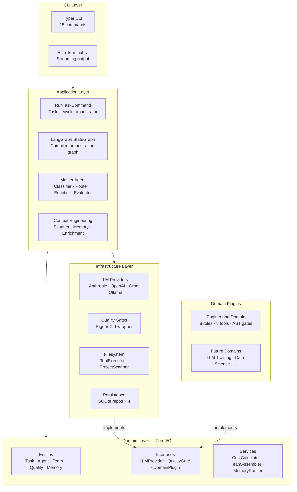

### Project Structure

```
rigovo/
├── cli/                  # Typer commands (15 total) + Rich terminal UI
│   ├── main.py           # CLI entry point — rigovo run, init, doctor, ...
│   ├── commands_*.py     # Command implementations grouped by concern
│   └── terminal/         # Rich console: streaming, approval prompts, summary
├── application/          # Use-case orchestration — the "brain"
│   ├── commands/         # RunTaskCommand — full task lifecycle orchestrator
│   ├── graph/            # LangGraph pipeline: builder, state, edges, 10 nodes
│   ├── master/           # Master Agent: classifier, router, enricher, evaluator
│   └── context/          # Context engineering: scanner, memory retriever, builder
├── domain/               # Pure domain logic — zero infrastructure dependencies
│   ├── entities/         # Task, Agent, Team, Workspace, Quality, Memory, Cost, Audit
│   ├── interfaces/       # LLMProvider, QualityGate, DomainPlugin, EventEmitter
│   └── services/         # CostCalculator, TeamAssembler, MemoryRanker
├── infrastructure/       # Concrete implementations (adapters)
│   ├── llm/              # Anthropic, OpenAI providers + model catalog + registry
│   ├── quality/          # Rigour CLI quality gate wrapper
│   ├── persistence/      # SQLite: tasks, costs, audit, memory (4 repos)
│   ├── filesystem/       # Tool executor: read/write files, run commands
│   ├── embeddings/       # Embedding models for memory similarity search
│   └── terminal/         # Rich console output with streaming
├── domains/              # Pluggable domain definitions
│   └── engineering/      # 8 agent roles, 8 tools, engineering-specific gates
├── config.py             # Layered config: built-in → YAML → .env → env vars → CLI
└── container.py          # Dependency injection (Composition Root)
```

---

## Pipeline Architecture

Every task flows through a compiled LangGraph `StateGraph` — a directed acyclic graph with conditional edges, parallel fan-out, and SQLite checkpointing for crash recovery.

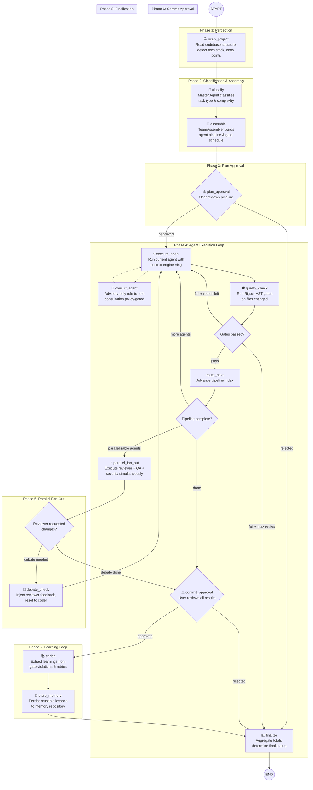

### Pipeline Nodes (10 total)

| # | Node | Purpose | Input | Output |
|---|------|---------|-------|--------|
| 1 | `scan_project` | Read codebase structure, detect tech stack | `project_root` | `ProjectSnapshot` |
| 2 | `classify` | Master Agent classifies task type & complexity | description + snapshot | `ClassificationData` |
| 3 | `assemble` | Build agent pipeline based on classification | classification + agents | `TeamConfig` with pipeline_order |
| 4 | `plan_approval` | User approves proposed pipeline | team config | approval_status |
| 5 | `execute_agent` | Run agent with full context engineering | agent config + context | `AgentOutput` |
| 6 | `quality_check` | Run Rigour AST gates on changed files | files_changed | `GateResult` |
| 7 | `route_next` | Advance to next agent, reset retry state | pipeline index | next agent config |
| 8 | `parallel_fan_out` | Execute independent agents simultaneously | remaining roles | merged `AgentOutput`s |
| 9 | `commit_approval` | User approves final results before commit | all outputs | approval_status |
| 10 | `enrich` + `store_memory` + `finalize` | Extract learnings, persist, aggregate | full state | final result |

---

## State Machine

All state flows through a single `TaskState` TypedDict — checkpointed after every node for crash recovery.

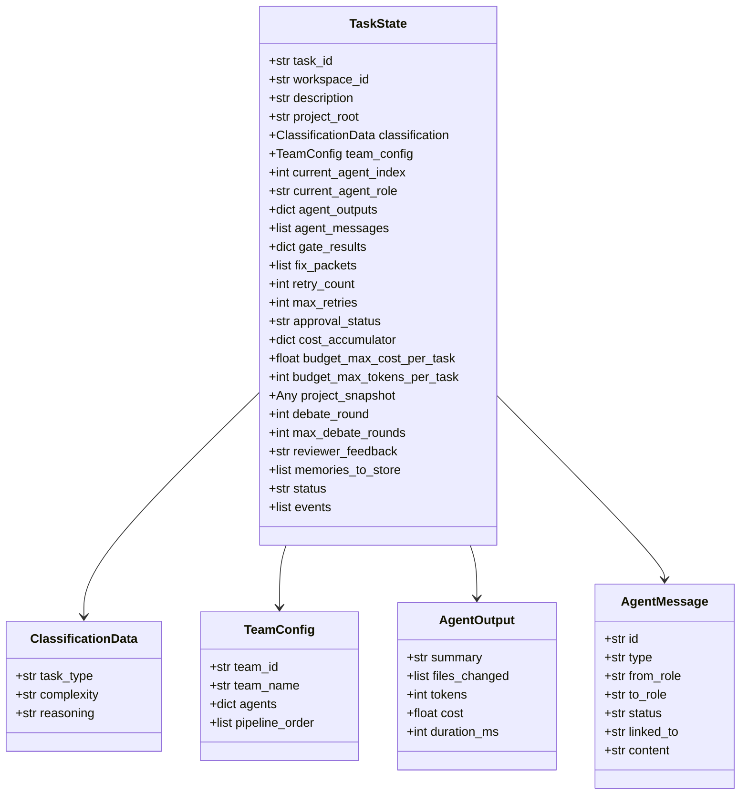

---

## Agent Execution — Context Engineering

Each agent executes within a 5-phase context engineering loop inspired by the Perceive → Remember → Reason → Act → Verify pattern.

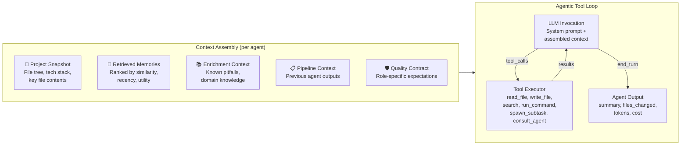

## Inter-Agent Consultation (Advisory Channel)

Agents can request targeted advice from other roles during execution via `consult_agent`. This is advisory-only and never replaces the target role's pipeline step.

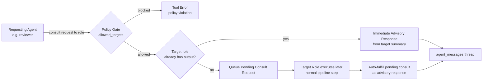

### Consultation Policy via `rigovo.yml`

```yaml
orchestration:
  consultation:
    enabled: true
    max_question_chars: 1200
    max_response_chars: 1200
    allowed_targets:
      planner: [lead, security, devops]
      coder: [reviewer, security, qa]
      reviewer: [planner, coder, security, qa, devops, sre, lead]
      qa: [coder, reviewer]
```

- `consultation.allowed_targets` overrides the default matrix.
- Consultation responses are tagged advisory-only and do not count as task completion for the consulted role.

### Context Budget

Context is assembled with hard character limits to prevent blowup:

| Layer | Max Chars | Content |
|-------|-----------|---------|
| Project Snapshot | 15,000 | File tree, tech stack, entry points, key file contents |
| Retrieved Memories | 5,000 | Top 8 memories ranked by relevance to role |
| Enrichment Context | 5,000 | Known pitfalls, domain knowledge, conventions |
| Pipeline Context | 8,000 | Previous agent outputs (planner's plan, coder's files) |
| Quality Contract | 2,000 | Role-specific expectations ("Pass gates on first try") |
| **Total Budget** | **40,000** | Hard cap across all layers |

### Memory Retrieval & Ranking

Memories are ranked per-agent using a weighted scoring formula:

```
score = (0.6 × similarity) + (0.2 × recency) + (0.2 × utility)
```

Each role gets role-specific memory preferences — the coder prefers `ERROR_FIX` and `PATTERN` memories, while the planner prefers `CONVENTION` and `DOMAIN_KNOWLEDGE`. Maximum 8 memories per agent to keep context focused.

---

## Task Classification & Routing

The Master Agent classifies every task at temperature 0.0 (deterministic) before any agent executes.

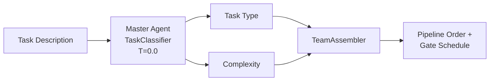

### Task Types → Agent Pipelines

| Type | Example | Pipeline | Gates After |
|------|---------|----------|-------------|
| `FEATURE` | "Add JWT auth" | planner → coder → reviewer → qa | coder |
| `BUG` | "Fix login crash" | coder → reviewer | coder |
| `REFACTOR` | "Split auth module" | planner → coder → reviewer | coder |
| `SECURITY` | "Fix SQL injection" | security → coder → reviewer → qa | coder |
| `TEST` | "Add unit tests" | qa | qa |
| `INFRA` | "Add Docker support" | devops → sre → reviewer | devops, sre |
| `PERFORMANCE` | "Optimize N+1 query" | coder → reviewer | coder |

### Complexity Adjustments

| Complexity | Modifications |
|------------|---------------|
| `LOW` | Minimal pipeline, lower budget |
| `MEDIUM` | Standard pipeline |
| `HIGH` | Prepend `lead` for architectural oversight |
| `CRITICAL` | Prepend `lead` + append `security` if not present |

---

## Quality Gates — Powered by Rigour

Every line of agent-generated code passes through [Rigour](https://github.com/rigour-labs/rigour) — deterministic AST checks, not LLM opinions. Catches issues the instant they're written, not after CI fails.

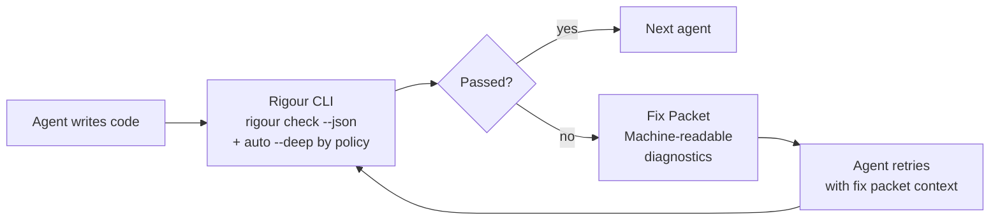

### Automatic Deep Analysis Policy (Default)

Rigovo does not rely on manual user flags for deep analysis. By default:

- `orchestration.deep_mode: final`
- Deep analysis runs automatically on the **final gated role** in the pipeline.
- Earlier gated roles use fast deterministic checks for speed.

Available modes:

- `never` — disable deep analysis
- `final` — deep on final gated role (default)
- `ci` — deep only when running `rigovo run --ci ...`
- `always` — deep on every gated role
- `critical_only` — deep only for `critical` complexity tasks

Use `orchestration.deep_pro: true` to run deep in pro tier.

Deep/pro output is parsed into the same violation model as standard gates, so agents receive fix packets and auto-correct without user intervention.

### What Rigour Catches

| Category | Gates | Examples |
|----------|-------|---------|
| **Security** | Hardcoded secrets, SQL injection, command injection, XSS, path traversal | `sk-ant-...` in source, `f"SELECT * FROM {user_input}"` |
| **AI Drift** | Hallucinated imports, duplication drift, context window artifacts, phantom APIs | `from utils.magic import solve` (doesn't exist) |
| **Structure** | Cyclomatic complexity, file size, function length, nesting depth | 500-line god function, 8 levels of nesting |
| **Safety** | Floating promises, unhandled errors, deprecated APIs, bare excepts | `async fetch()` with no `await` |

### Fix Packet Protocol

When gates fail, Rigour generates structured **Fix Packets** — machine-readable diagnostics that agents consume directly. No human interpretation needed.

```
[FIX PACKET]
Attempt 1 of 5:
- [ERROR] no_hardcoded_secrets: Found API key in src/config.py:42
  Suggestion: Move to environment variable, use os.getenv("API_KEY")
- [WARNING] max_function_length: Function process_data() is 127 lines
  Suggestion: Extract helper functions for each processing step
```

Agents retry automatically with the fix packet injected into their context, up to `max_retries` (default: 5).

---

## Agent Debate Protocol

When the reviewer requests changes, the system enters a structured debate loop between the coder and reviewer — like a real code review.

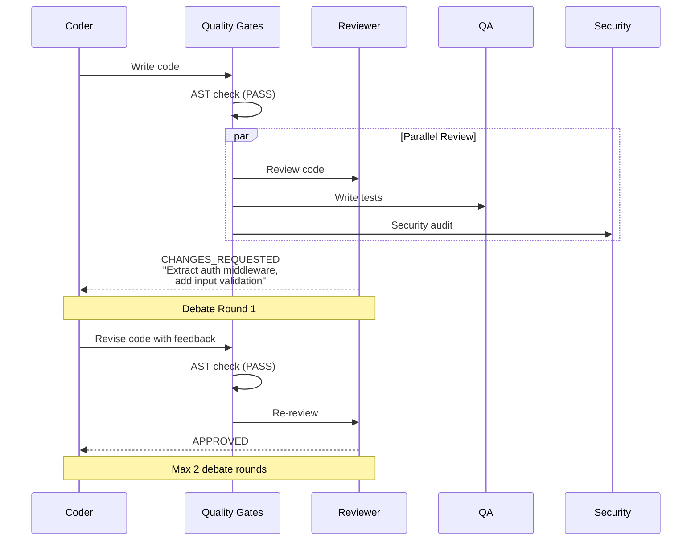

The debate protocol detects markers in reviewer output (`CHANGES_REQUESTED`, `BLOCKED`, `needs revision`), injects the reviewer's feedback as a fix packet, and routes the coder back for another pass. Maximum 2 debate rounds by default.

---

## Parallel Execution

Independent agents execute simultaneously — cutting review-phase time from sum(individual) to max(individual).

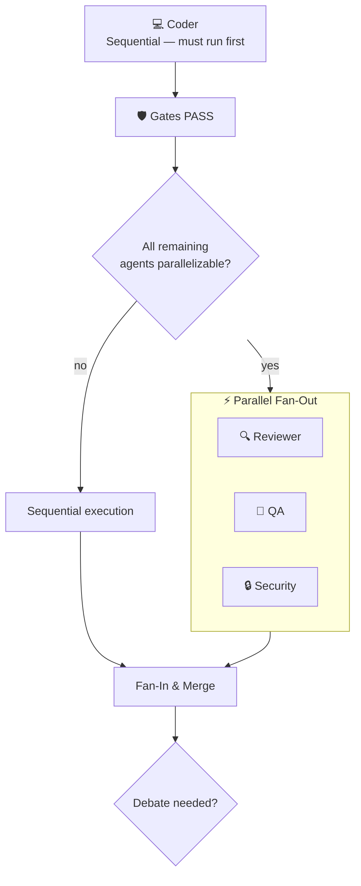

### Parallelizable Roles

These roles have no inter-dependency — they all read the coder's output independently:

- `reviewer` — Code review and feedback
- `qa` — Test generation and validation
- `security` — Security audit
- `docs` — Documentation generation

Non-parallelizable roles (planner, coder, lead) must run sequentially because later agents depend on their output.

### Parallel Tool Execution

Within a single agent's tool loop, multiple tool calls from one LLM response execute simultaneously via `asyncio.gather()`. When the coder asks to read 5 files at once, all 5 reads happen in parallel.

---

## Sub-Agent Spawning

Agents can decompose complex tasks by spawning independent sub-agents — each with full tool access.

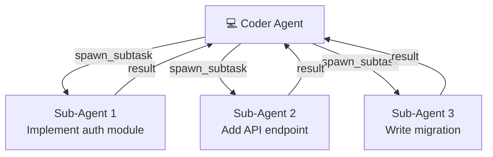

The `spawn_subtask` tool allows agents to create parallel sub-agents during their agentic loop. Each sub-agent receives full tool access (read_file, write_file, search_codebase, run_command) and returns its output to the parent agent.

---

## Model Selection System

Rigovo uses intelligent per-role model defaults — the right model for each job.

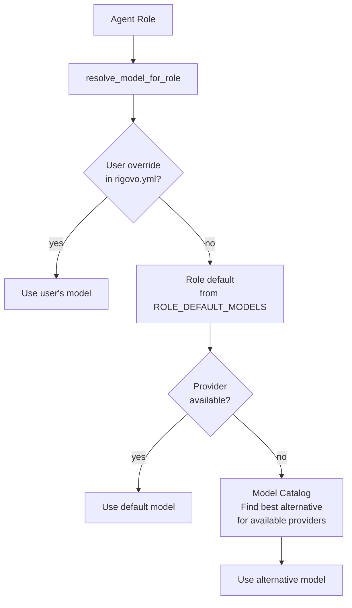

### Default Model Assignments

| Role | Default Model | Tier | Why |
|------|---------------|------|-----|
| `lead` | Claude Opus 4.6 | Premium | Architectural decisions need strongest reasoning |
| `planner` | Claude Sonnet 4.6 | Standard | Planning: fast + smart enough |
| `coder` | Claude Opus 4.6 | Premium | Coding: best agent model for complex implementations |
| `reviewer` | Claude Sonnet 4.6 | Standard | Code review needs analysis, Sonnet suffices |
| `security` | Claude Haiku 4.5 | Budget | Checklist-based security audit |
| `qa` | Claude Haiku 4.5 | Budget | Test generation is formulaic |
| `devops` | Claude Haiku 4.5 | Budget | Template-based configurations |
| `sre` | Claude Haiku 4.5 | Budget | Template-based configurations |
| `docs` | Claude Haiku 4.5 | Budget | Text generation |

### Multi-Provider Support

Rigovo is provider-agnostic. If you only have an OpenAI key, the catalog resolves the best GPT model for each tier. Supported providers:

| Provider | Models | SDK |
|----------|--------|-----|
| Anthropic | Claude Opus 4.6, Sonnet 4.6, Haiku 4.5 | `anthropic` |
| OpenAI | GPT-5, GPT-5 Mini, GPT-4o, o1, o3-mini | `openai` |
| Google | Gemini 2.5 Pro, Gemini 2.5 Flash | `openai` compatible |
| DeepSeek | V3.2, R1 | `openai` compatible |
| Mistral | Large 3, Medium 3, Codestral | `openai` compatible |
| Groq | Llama 3.3 70B | `openai` compatible |
| Ollama | Any local model | `openai` compatible |
| Custom | Any OpenAI-compatible endpoint | `openai` compatible |

### Preset System

Three presets auto-assign models across all roles:

| Preset | Description | Estimated Cost/Task |
|--------|-------------|---------------------|
| `budget` | Cheapest — still good for most tasks | ~$0.02 |
| `recommended` | Best quality/cost ratio | ~$0.15 |
| `premium` | Maximum quality — for critical tasks | ~$0.50 |

---

## LLM Provider Architecture

All LLM interactions go through a unified `LLMProvider` interface — the application layer never touches a concrete SDK.

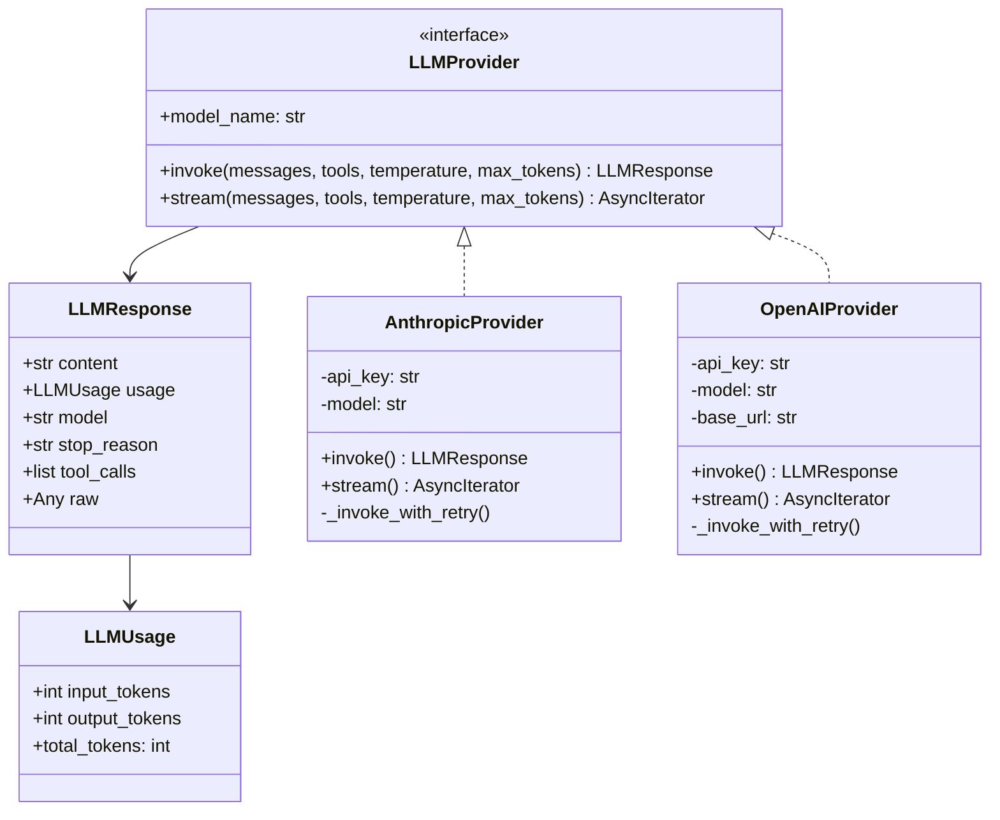

### Token Optimization

- **Prompt Caching (Anthropic):** System prompts use `cache_control: {type: "ephemeral"}` — saving 90% of input tokens after the first call in an agentic loop (cached tokens cost 10% of fresh tokens).
- **Prompt Caching (OpenAI):** Automatic prefix-based caching for repeated message prefixes (1024+ tokens). Optimized by keeping system messages at the start for prefix matching.
- **Tool Result Truncation:** Tool results are capped at 30,000 characters to prevent context window blowup from large file reads.
- **Retry with Exponential Backoff:** Both providers retry transient errors (429, 529, 500, 502, 503) with exponential backoff (1s, 2s, 4s, 8s, 16s) — up to 5 attempts.

---

## Cost Tracking & Budget Guards

Every LLM call is tracked. Budget guards prevent runaway costs by halting execution when limits are exceeded.

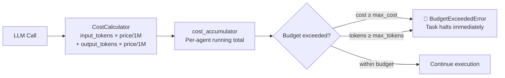

Default limits: `$2.00` per task, `200,000` tokens per task. Configurable in `rigovo.yml`.

---

## Approval System

Two human-in-the-loop checkpoints ensure you stay in control:

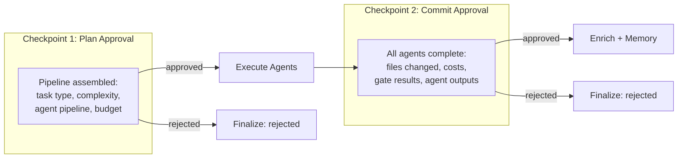

- **Plan Approval** — Review the proposed pipeline before any agent executes
- **Commit Approval** — Review all results before finalizing

Both checkpoints can be auto-approved for CI/CD workflows or interactive for human-in-the-loop development.

---

## Memory & Learning Loop

Rigovo learns from every task — quality gate failures become training data, not just errors.

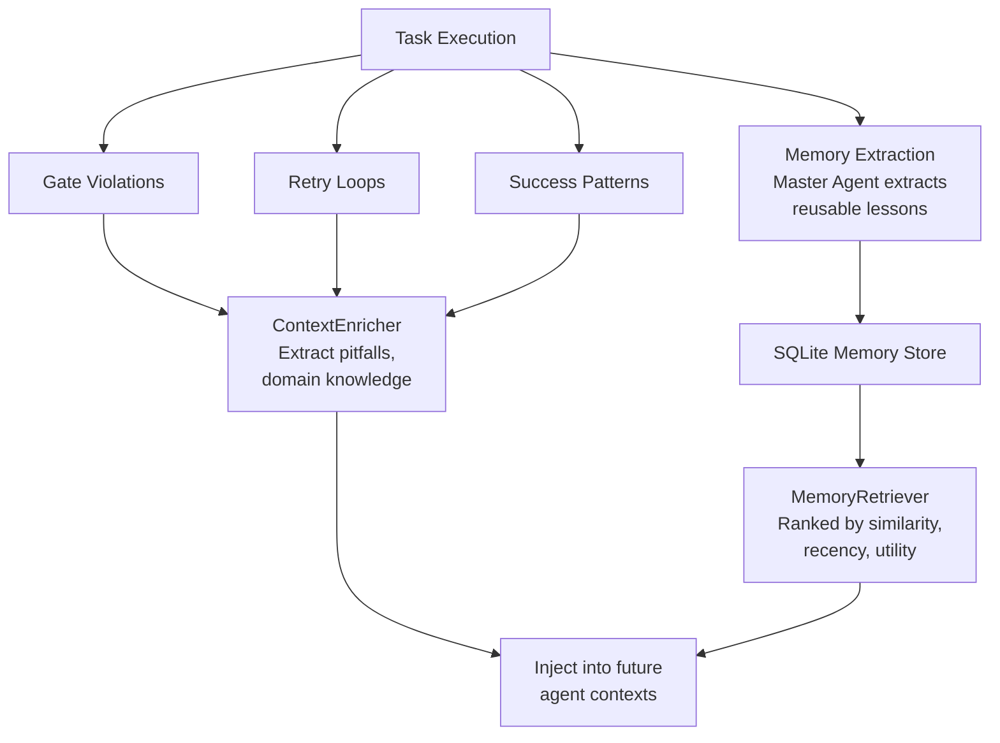

### Memory Types

| Type | Example | Used By |
|------|---------|---------|
| `PATTERN` | "Use factory pattern for service creation" | Coder, Planner |
| `ERROR_FIX` | "SQLAlchemy async sessions need `expire_on_commit=False`" | Coder |
| `CONVENTION` | "All endpoints use Pydantic v2 model_validator" | Coder, Reviewer |
| `DOMAIN_KNOWLEDGE` | "Auth module uses JWT with 15-min access tokens" | All agents |
| `TASK_OUTCOME` | "Adding endpoints requires updating OpenAPI docs" | Planner |

---

## Persistence Layer

Four SQLite repositories handle all persistence — zero external database dependencies.

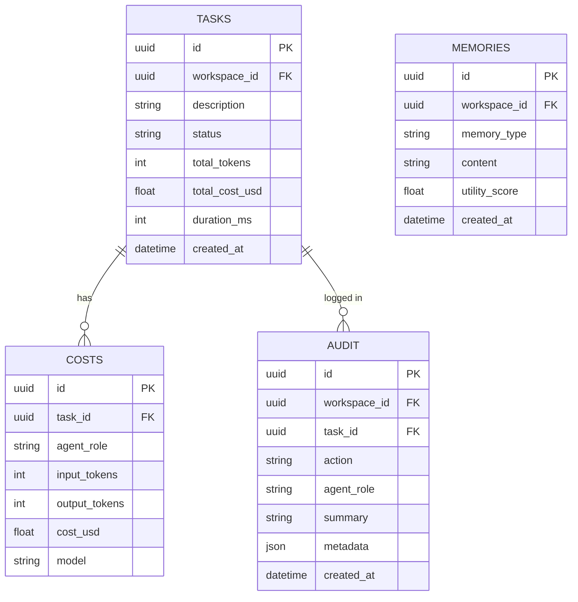

Additionally, LangGraph uses a separate SQLite database (`.rigovo/checkpoints.db`) for state checkpointing — enabling crash recovery mid-task.

---

## Domain Plugin System

Rigovo is domain-extensible through a plugin interface. The `engineering` domain ships built-in; future domains (LLM training, data science) plug in the same way.

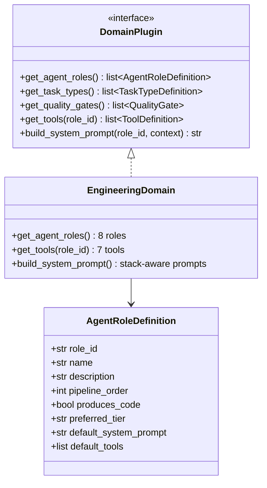

### Engineering Domain — 8 Roles

| Role | Name | Produces Code | Pipeline Order | Tools |
|------|------|:---:|:---:|---|
| `planner` | Technical Planner | — | 0 | read_file, list_directory, search_codebase, read_dependencies |
| `coder` | Software Engineer | ✓ | 1 | read_file, write_file, list_directory, search_codebase, run_command, read_dependencies, spawn_subtask |
| `reviewer` | Code Reviewer | — | 2 | read_file, list_directory, search_codebase |
| `security` | Security Expert | — | 3 | read_file, list_directory, search_codebase |
| `qa` | QA Engineer | ✓ | 4 | read_file, write_file, list_directory, search_codebase, run_command |
| `devops` | DevOps Engineer | ✓ | 5 | read_file, write_file, list_directory, run_command |
| `sre` | Site Reliability Engineer | ✓ | 6 | read_file, write_file, list_directory, run_command |
| `lead` | Tech Lead | — | 7 | read_file, list_directory, search_codebase |

### Tool Definitions

| Tool | Description |
|------|-------------|
| `read_file` | Read file contents with optional line range |
| `write_file` | Create or modify files (creates parent directories) |
| `list_directory` | Recursive directory listing |
| `search_codebase` | Regex search across project files |
| `run_command` | Execute shell commands (tests, builds, linting) with timeout |
| `read_dependencies` | Parse package.json, pyproject.toml, requirements.txt, etc. |
| `spawn_subtask` | Spawn independent sub-agent with full tool access |

---

## All 15 Commands

### Setup

| Command | What it does |
|---------|-------------|
| `rigovo init` | Auto-detect your stack, generate `rigovo.yml` + `rigour.yml` + `.env` |
| `rigovo doctor` | Validate everything — config, API keys, dependencies, Rigour gates |
| `rigovo version` | Show CLI version |
| `rigovo upgrade` | Check PyPI for updates |

### Run

| Command | What it does |
|---------|-------------|
| `rigovo run "Add JWT auth"` | Full pipeline — plan → code → review → gates → done |
| `rigovo run "Fix bug" --ci` | CI mode — JSON output, non-interactive |
| `rigovo run "Deploy" --team ops` | Target a specific team |
| `rigovo replay <task_id>` | Re-run a failed task with same parameters |

### Inspect

| Command | What it does |
|---------|-------------|
| `rigovo teams` | List teams with agents, models, and rules |
| `rigovo agents` | Agent summary table |
| `rigovo agents coder` | Deep inspect a specific agent |
| `rigovo config` | View full `rigovo.yml` |
| `rigovo config orchestration.budget` | View a specific config section |
| `rigovo status` | Project health — tasks, costs, Rigour score |

### Track

| Command | What it does |
|---------|-------------|
| `rigovo history` | Task history with outcomes, costs, durations |
| `rigovo history <task_id>` | Detailed view of a specific run |
| `rigovo costs` | Cost breakdown — per task, per agent, totals |
| `rigovo export` | Export as JSON (default) or `--format csv` |
| `rigovo login` | Authenticate with Rigovo Cloud |
| `rigovo dashboard` | Open cloud dashboard in browser |

---

## Configuration

Rigovo uses layered configuration — higher layers override lower:

```
Built-in defaults → rigovo.yml → rigour.yml → .env → env vars → CLI flags
```

### Quick Config Examples

`rigovo init` writes a complete `rigovo.yml` with all schema fields and defaults. The examples below show common overrides.

**Override agent model:**
```yaml
# rigovo.yml
teams:
  engineering:
    agents:
      coder:
        model: "gpt-5"             # Use GPT-5 for coding
        temperature: 0.1
      security:
        model: "claude-opus-4-6"    # Use Opus for security
```

**Set budget limits:**
```yaml
orchestration:
  budget:
    max_cost_per_task: 2.00       # USD per task
    max_tokens_per_task: 200000
    monthly_budget: 100.00        # USD per month
    alert_at_percent: 0.80        # Alert at 80%
```

**Select database backend (company mode):**
```yaml
database:
  backend: postgres               # sqlite|postgres
  local_path: .rigovo/local.db    # used when backend=sqlite
```

Set `RIGOVO_DB_URL` in `.env` when using `postgres`.

**Deep analysis policy (automatic by default):**
```yaml
orchestration:
  deep_mode: final                # never|final|ci|always|critical_only
  deep_pro: false                 # true = use pro deep tier
```

**Inter-agent consultation policy:**
```yaml
orchestration:
  consultation:
    enabled: true
    max_question_chars: 1200
    max_response_chars: 1200
    allowed_targets:
      reviewer: [planner, coder, security, qa, devops, sre, lead]
```

**Add custom rules per agent:**
```yaml
teams:
  engineering:
    agents:
      coder:
        rules:
          - "Use Pydantic v2 model_validator"
          - "All endpoints must have OpenAPI docs"
          - "Use dependency injection for services"
```

**Human-in-the-loop approvals:**
```yaml
approval:
  after_planning: true     # Review the plan before coding
  before_commit: true      # Approve before git commits
  auto_approve:
    - type: "test"         # Auto-approve test tasks
      max_files: 3
    - type: "docs"         # Auto-approve docs tasks
```

**Custom OpenAI-compatible provider:**
```yaml
providers:
  my_local:
    base_url: "http://localhost:11434/v1"
    api_key_env: "OLLAMA_API_KEY"
    input_price: 0.0
    output_price: 0.0
```

### Environment Variables

```bash
# .env (auto-generated by rigovo init — gitignored)
ANTHROPIC_API_KEY=sk-ant-...      # Required for Claude models
# OPENAI_API_KEY=sk-...           # Alternative: GPT models
# GOOGLE_API_KEY=...              # Alternative: Gemini models
# DEEPSEEK_API_KEY=...            # Alternative: DeepSeek models
# GROQ_API_KEY=...                # Alternative: Groq models
# MISTRAL_API_KEY=...             # Alternative: Mistral models
# RIGOVO_API_KEY=...              # Optional: cloud sync
```

---

## Rigour CLI Auto-Install

The Rigour quality gate CLI auto-installs on first use — no manual setup required.

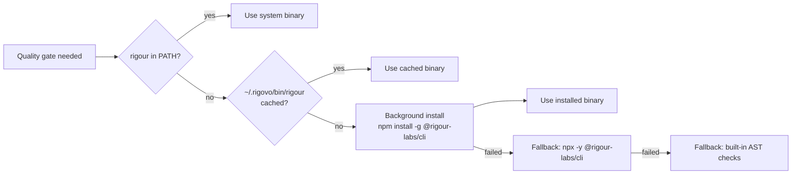

The install runs in background alongside the planner agent — by the time quality gates need the CLI, it's already ready. Eliminates the 30-60s first-run latency entirely.

---

## CI/CD

GitHub Actions with PyPI Trusted Publishing (OIDC). CI runs tests + lint + Rigour gates. Versioning via [python-semantic-release](https://python-semantic-release.readthedocs.io/) with [Conventional Commits](https://www.conventionalcommits.org/).

---

## Development

```bash
git clone https://github.com/rigovo/rigovo-virtual-team.git && cd rigovo-virtual-team
pip install -e ".[dev]"
pytest                                    # 353 tests
npx @rigour-labs/cli check               # Rigour gates
```

Requires Python 3.10+, Node.js 18+ (for Rigour CLI), and an API key for at least one LLM provider.

## License

MIT — [Rigovo](https://rigovo.com)

Built by [Ashutosh Singh](https://github.com/erashu212) — author of [Rigour](https://github.com/rigour-labs/rigour).
