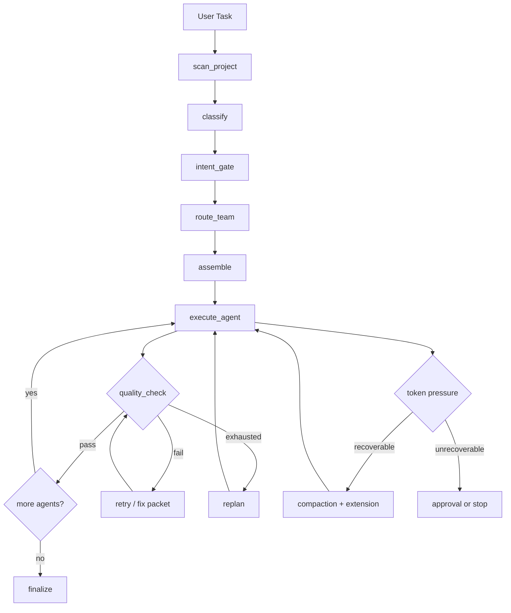

<p align="center">
  
</p>

<h1 align="center">Rigovo Teams</h1>

<p align="center">
  <strong>Multi-agent software delivery with deterministic quality gates, adaptive cost control, and auditable learning.</strong>
</p>

---

## 90-Second Evaluation

Use this to decide quickly if Rigovo is a fit:

1. Start desktop locally: `./scripts/e2e_desktop.sh`
2. Run one real engineering task in Control Plane
3. Validate three outcomes in one run:
   - gate trace is explicit (pass/fail + evidence)
   - spend is visible (tokens/cost + pressure handling)
   - execution is explainable (map/timeline/logs)

If you need governance, auditability, and predictable delivery quality, continue rollout.

---

## What Rigovo Teams Is

Rigovo Teams is a desktop-first orchestration platform for engineering work.

It runs a structured multi-agent pipeline (planning, coding, review, QA, security, operations), enforces quality and policy at each stage, and exposes full execution traceability so teams can ship with confidence.

---

## Why Teams Use It

- Predictable quality: deterministic gates during execution, not only at the end
- Predictable spend: adaptive budget controls with token-pressure recovery paths
- Operational trust: explicit approvals, audit trails, and rollbackable learning promotions
- Local control: launch profile is local-first with SQLite runtime storage

### Best Fit

- Teams shipping production software with review/compliance expectations
- Operators who need to explain why a run succeeded or failed
- Organizations optimizing quality-per-dollar, not chat volume

### Not Ideal

- Pure ad-hoc chat coding with no process requirements
- Teams that do not need auditability or policy controls

---

## Core Capabilities

### 1) Multi-Agent Orchestration

- Role-specific agent pipeline with explicit handoffs
- Retry and replan behavior on failures
- Team routing by task intent

### 2) Deterministic Quality Gates

- Rigour checks between agent stages
- Gate decisions and evidence are persisted and inspectable
- Policy-driven approvals for sensitive actions

### 3) Adaptive Cost Management

- Intent-aware budget policy
- Internal warning before hard-fail paths
- Auto-compaction and controlled extension behavior under token pressure

### 4) Layered Memory + Learning Governance

- `task_memory`: ephemeral run context
- `workspace_memory`: long-lived project context
- `agent_skill_memory`: role-specific promoted learning
- Promotion ledger with rollback support and operator visibility

### 5) Full Traceability

- Map / Timeline / Logs in desktop UI
- Per-task cost, token, gate, and cache telemetry
- Promotion and rollback audit history

---

## Runtime Flow



---

## Canonical Agent Roles

Use these canonical keys in config, policy, and automation:

| Canonical Key | UI Label |
|---|---|
| `lead` | Tech Lead |
| `planner` | Project Manager |
| `coder` | Software Engineer |
| `reviewer` | Code Reviewer |
| `qa` | QA Engineer |
| `security` | Security Engineer |
| `devops` | DevOps |
| `sre` | SRE |
| `docs` | Technical Writer |

---

## Desktop Product Surface

- **Control Plane**: task status, execution controls, map/timeline/logs
- **Skills**: role models, role grants, integration visibility
- **Automations**: approvals inbox, governance and queue health
- **Settings**: policy, capabilities, memory controls, agent configuration

---

## Memory and Learning API (Key Endpoints)

```text
GET    /v1/memory/metrics
GET    /v1/memory/promotions
POST   /v1/memory/promotions/{promotion_id}/rollback
GET    /v1/adaptive/metrics
```

General task/control endpoints:

```text
POST   /v1/tasks
GET    /v1/tasks/{id}
GET    /v1/tasks/{id}/detail
GET    /v1/ui/inbox
GET    /v1/ui/approvals
POST   /v1/tasks/{id}/approve
POST   /v1/tasks/{id}/deny
GET    /v1/settings
POST   /v1/settings
GET    /v1/runtime/capabilities
```

---

## Storage and Launch Scope

Current launch profile:

- Local-first runtime
- SQLite as the active runtime database (`.rigovo/local.db`)
- Desktop-first operations

Note:

- Postgres persistence code exists in the repo for future deployment modes.
- SQLite is the active and supported launch path today.

---

## Technology Stack

- Backend: Python, FastAPI, LangGraph
- Desktop: Electron, React, TypeScript
- Quality engine: Rigour
- Runtime DB: SQLite

---

## Quick Start

### Prerequisites

- Python 3.10+
- Node.js 20+
- pnpm 9+
- LLM API key(s)

### Install

```bash
python3 -m pip install -e .
pnpm -C apps/desktop install
```

### Run desktop (dev)

```bash
./scripts/e2e_desktop.sh
```

### Build desktop app

```bash
pnpm -C apps/desktop run build
```

### Run tests

```bash
pytest -q
```

---

## Release Packaging

Desktop release workflow builds:

- macOS: `.dmg`, `.zip`
- Linux: `.AppImage`, `.deb`
- Windows: `.exe` (NSIS)

Workflow file:

- [desktop-release.yml](.github/workflows/desktop-release.yml)

---

## Positioning

Rigovo Teams is built for organizations that want both velocity and control:

- faster execution through coordinated agents
- higher confidence through deterministic gates
- lower operational surprise through transparent cost, memory, and audit systems
