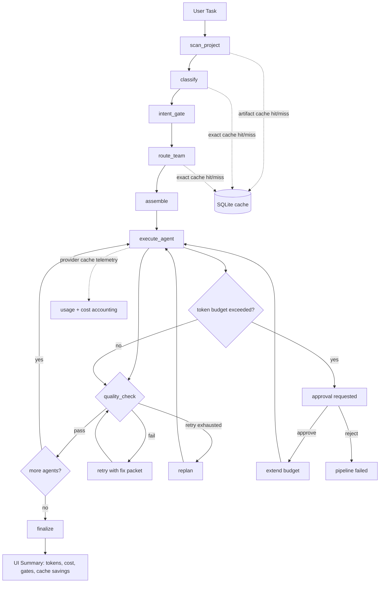

<p align="center">
  
</p>

<h1 align="center">Rigovo Teams</h1>

<p align="center">
  <strong>Multi-agent software engineering with deterministic quality gates, transparent cost, and launch-speed execution.</strong>
</p>

---

## What Rigovo Is

Rigovo Teams is a local-first AI engineering runtime that turns a task prompt into a structured, auditable software delivery flow.

It is designed for teams that want:

1. High intelligence output (planning + implementation + review)
2. Strict quality enforcement (Rigour gates)
3. Cost discipline (intent budgets, cache reuse, approval checkpoints)
4. Full observability (map, timeline, logs, per-step token/cost telemetry)

---

## Why This Is Different

Tools like Cursor, Claude Code, and Codex are strong chat-first coding copilots for direct human-in-the-loop editing.

Rigovo targets a different operating model: orchestrated, policy-aware, multi-agent execution.

| Area | Rigovo Teams | Typical Chat-First Coding Assistant |
|---|---|---|
| Execution model | Multi-agent pipeline with explicit handoffs | Single active assistant loop |
| Cost controls | Intent gate + token budgets + budget approval checkpoint | Usually prompt/session level controls |
| Quality | Deterministic Rigour gates in pipeline | Mostly prompt-guided or post-hoc checking |
| Auditability | Structured events, checkpoints, approvals, gate history | Primarily conversation history |
| Caching | Provider cache + Rigovo exact/artifact cache telemetry | Provider-level caching only (varies by tool) |
| Team UX | Map, Timeline, Logs aligned to pipeline state | Editor/chat centric UI |

If your goal is "finish production tasks with clear governance and predictable spend", Rigovo is the better fit.

---

## Launch Architecture (Current)

### Core runtime path

1. Scan workspace
2. Classify task
3. Detect intent and enforce budget/profile
4. Route team and assemble agents
5. Execute agents with gate checks and retries
6. Finalize with confidence, costs, and full event trace

### Token budget policy (current defaults)

| Intent | Max Agents | Tool Rounds | File Reads | Token Budget |
|---|---:|---:|---:|---:|
| brainstorm | 2 | 3 | 0 | 50,000 |
| research | 3 | 10 | 15 | 150,000 |
| fix | 4 | 12 | 30 | 200,000 |
| build | 6 | 10 | unlimited | 200,000 |

When the token budget is reached, Rigovo raises a budget approval checkpoint.
If approved, the run extends budget and continues; if rejected, the run stops cleanly.

---

## Mermaid Flow Diagram



---

## Caching Strategy (Implemented)

Rigovo currently runs three practical cache layers:

1. Provider prompt cache telemetry
   - Anthropic and OpenAI cached input/write tokens are normalized into usage.
2. Rigovo exact cache
   - Deterministic reuse for classification fallback and team routing.
3. Artifact cache
   - Project scan snapshot and knowledge graph reuse when workspace fingerprint is unchanged.

All cache effects are surfaced in task detail:

- `cache_hits_exact`
- `cache_hit_rate`
- `cache_saved_tokens`
- `cache_saved_cost_usd`
- `provider_cached_input_tokens`

---

## Quality and Trust Model

Rigovo uses deterministic quality checks in the execution loop, not only prompt instructions.

- Gate pass/fail is explicit in state and UI.
- Retries are structured (with fix packets).
- Replan is explicit and visible.
- Confidence is derived from concrete run evidence (gates, retries, outcomes).

---

## Desktop UX

The desktop app provides three synchronized run views:

1. Map - agent graph and current state
2. Timeline - chronological execution narrative
3. Logs - compact step-level operational data

Users can inspect:

- What ran
- What failed
- Which gate failed
- What was retried
- What cache/budget decisions happened
- What it cost

---

## Tech Stack

- Backend: Python + FastAPI + LangGraph
- Runtime DB: SQLite (`.rigovo/local.db`)
- Desktop: Electron + React + TypeScript
- Quality engine: Rigour

Note: current launch path is SQLite-first local runtime.

---

## Quick Start

### Prerequisites

- Python 3.10+
- Node.js 20+
- pnpm 9+
- At least one LLM API key (Anthropic/OpenAI/etc.)

### Install dependencies

```bash
python3 -m pip install -e .
pnpm -C apps/desktop install
```

### Start desktop dev flow

```bash
./scripts/e2e_desktop.sh
```

### Run backend tests (targeted)

```bash
pytest -q tests/unit/api/test_control_plane_ping.py
pytest -q tests/unit/application/test_graph_nodes_execute_agent.py
pytest -q tests/unit/application/test_langgraph_engine.py -k "pipeline_classifies_task or pipeline_executes_agents or auto_approve_mode"
```

### Build desktop

```bash
pnpm -C apps/desktop run build
```

---

## Configuration

`rigovo.yml` (example):

```yaml
version: "1"

teams:
  engineering:
    agents:
      planner:
        model: "claude-sonnet-4-6"
      coder:
        model: "claude-opus-4-6"
      reviewer:
        model: "claude-sonnet-4-6"

orchestration:
  max_retries: 5
  consultation:
    enabled: true
  replan:
    enabled: true
    strategy: deterministic

approval:
  after_planning: true
  before_commit: true

quality:
  deep_mode: "smart"

database:
  backend: sqlite
  local_path: ".rigovo/local.db"
```

---

## API Surface

```text
POST   /v1/tasks
GET    /v1/tasks/{id}
GET    /v1/tasks/{id}/detail
GET    /v1/ui/inbox
GET    /v1/ui/approvals
POST   /v1/tasks/{id}/approve
POST   /v1/tasks/{id}/deny
GET    /v1/settings
POST   /v1/settings
GET    /v1/projects
POST   /v1/projects
GET    /health
```

---

## Launch Positioning

Rigovo wins when users care about outcome per dollar, not just autocomplete speed:

- Fewer wasted tokens through intent routing and cache reuse
- Fewer broken outputs through deterministic gate enforcement
- Higher trust through full execution audit trail

That combination (intelligence + rigour + cost transparency) is the product moat.

---

## License

MIT - see [LICENSE](LICENSE)
